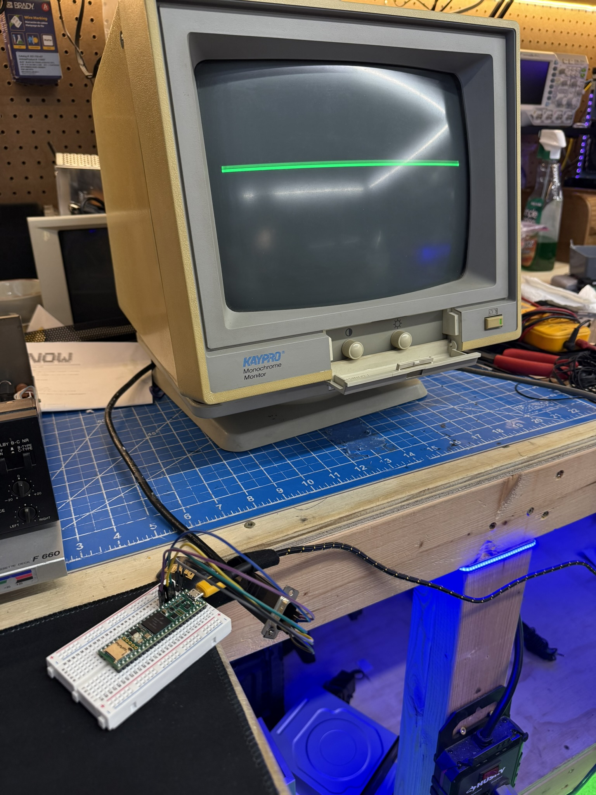
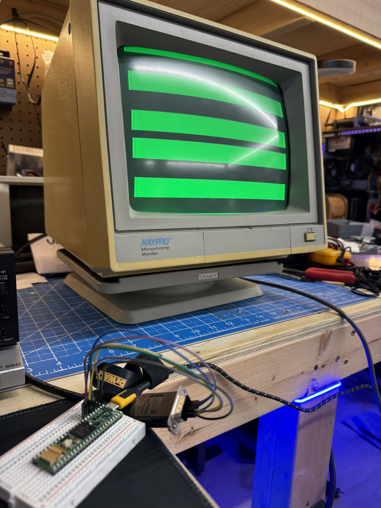
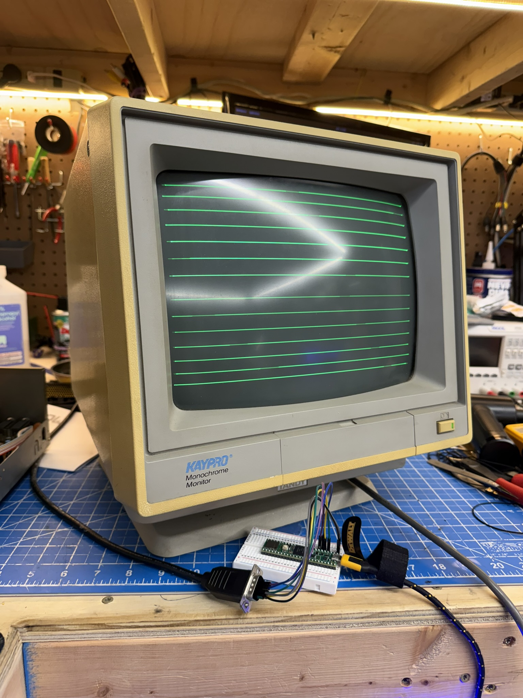

# Kaypro CRT Driver for Teensy 4.1

Drive vintage 1980s Kaypro monochrome CRT monitors with modern microcontrollers. Generate stable video signals with test patterns, convergence tools, and text rendering capabilities.


*Crosshair convergence test pattern for center alignment*

## Features

- ✅ **Stable Sync Signals** - Hardware timer-based 18.432 kHz horizontal / 50 Hz vertical sync
- ✅ **10 Test Patterns** - Convergence tools including crosshair, grid, circles, corners, borders
- ✅ **TEXT RENDERING WORKING!** - Blocky but readable text on vintage CRT
- ✅ **8×8 Bitmap Font** - 95 printable ASCII characters
- ✅ **Serial Control** - Switch patterns via USB serial commands
- ✅ **Level Shifted Signals** - Clean 5V TTL via SN74LS245N
- ⚠️ **Partial Resolution** - 270 pixels/line achieved (full 720 not possible in ISR)

## Gallery

| Horizontal Bars | Multiple Lines |
|----------------|----------------|
|  |  |
| *Pattern test: Horizontal stripes* | *Text rendering (lines visible, pixel rendering in progress)* |

## Hardware Requirements

### Monitor
- **Tested:** Kaypro KP-1254G (12-inch green phosphor, 1986)
- **Compatible:** Most IBM MDA/Hercules monitors (720×350 @ 50Hz)
- **Resolution:** 720 × 350 pixels
- **Horizontal Frequency:** 18.432 kHz (54.25 µs per line)
- **Vertical Frequency:** 50 Hz (20 ms per frame)
- **Connector:** DB-9 Female

### Microcontroller
- **Board:** Teensy 4.1
- **CPU:** ARM Cortex-M7 @ 600 MHz
- **Why Teensy:** Hardware timers provide sub-microsecond precision for CRT sync

### Level Shifter (Recommended)
- **Part:** SN74LS245N Octal Bus Transceiver
- **Purpose:** Converts Teensy's 3.3V logic to monitor's 5V TTL levels
- **Status:** Works without it, but expect flicker and reduced brightness
- **Future:** Clean 5V signals enable proper pixel-level text rendering

## Wiring

| Teensy 4.1 Pin | Monitor DB-9 Pin | Signal          | Notes                    |
|----------------|------------------|-----------------|--------------------------|
| GND            | Pin 1 or 2       | Ground          | Common ground            |
| Pin 2          | Pin 7            | Video           | Main video signal        |
| Pin 3          | Pin 6            | Intensity       | Brightness control       |
| Pin 4          | Pin 8            | Horizontal Sync | Positive polarity        |
| Pin 5          | Pin 9            | Vertical Sync   | Negative polarity (inverted) |

**Critical:** HSync is positive polarity (HIGH = active), VSync is negative polarity (LOW = active).

## Installation

### Using PlatformIO (Recommended)

```bash
git clone https://github.com/your-repo/Kaypro_CRT_Project.git
cd Kaypro_CRT_Project
pio run                    # Compile
pio run --target upload    # Upload (press Teensy button when prompted)
```

### Using Arduino IDE

1. Install [Teensyduino](https://www.pjrc.com/teensy/td_download.html)
2. Open `src/Kaypro_CRT_Driver.ino`
3. Configure:
   - **Tools → Board:** Teensy 4.1
   - **Tools → CPU Speed:** 600 MHz
   - **Tools → USB Type:** Serial
4. Upload sketch

## Usage

### Switching Test Patterns

Connect via serial (115200 baud) and send pattern numbers:

```bash
# Using echo (Linux/macOS)
echo "1" > /dev/ttyACM0   # Crosshair
echo "2" > /dev/ttyACM0   # Grid
echo "5" > /dev/ttyACM0   # Border

# Using screen
screen /dev/ttyACM0 115200
# Then type: 1, 2, 5, etc.
```

### Available Patterns

| Number | Pattern       | Purpose                          |
|--------|---------------|----------------------------------|
| 0      | Stripes       | Basic sync timing test           |
| 1      | Crosshair     | Center alignment                 |
| 2      | Grid          | Geometry and linearity testing   |
| 3      | Circles       | Focus adjustment                 |
| 4      | Corner Marks  | Overscan detection               |
| 5      | Border        | Edge visibility test             |
| 6      | Checkerboard  | Alternating pattern test         |
| 7      | Full White    | Brightness/burn-in test          |
| 8      | Full Black    | Blank screen                     |
| 9      | Text Demo     | Text rendering (infrastructure)  |

## Technical Details

### Video Signal Generation

The driver uses Teensy's `IntervalTimer` to generate precise horizontal sync pulses every 54.25 µs. Each interrupt:

1. **Outputs horizontal sync pulse** (3.5 µs HIGH)
2. **Manages vertical sync state** (based on current scan line)
3. **Generates video content** (procedural patterns or framebuffer data)
4. **Advances line counter** (wraps at 370 lines = 50 Hz)

### Timing Specifications (MDA Standard)

```
Horizontal:
  Total time:   54.25 µs  (18.432 kHz)
  Front porch:   1.5 µs
  Sync pulse:    3.5 µs
  Back porch:    4.0 µs
  Active video: 45.25 µs  (720 pixels)

Vertical:
  Total lines:  370 lines (50 Hz)
  Front porch:    3 lines
  Sync pulse:     3 lines
  Back porch:    14 lines
  Active video: 350 lines
```

### Text Rendering Architecture

**v1.4 Status: TEXT IS RENDERING!** Characters visible but blocky due to timing constraints.

- **Font:** 8×8 bitmap font, 95 printable ASCII characters
- **Framebuffer:** 31,500 bytes (720×350 pixels, 1-bit monochrome)
- **Current achievement:** 270 pixels/line (3-bit sampling per byte)
- **Rendering method:** Samples bits 7, 4, and 0 from each byte
- **Result:** Readable but blocky text, some vertical strokes missing
- **Example:** "KAYPRO" displays as "CAPCCD" (K→C due to missing strokes)

### Technical Limitations Discovered

- **720 pixels in 45.25 µs = 62.67 ns per pixel**
- **At 600 MHz = only 37 CPU cycles per pixel**
- **Reality:** Even optimized C code needs >37 cycles per pixel
- **Solution:** 3-bit sampling gives readable text at 270 pixels
- **Future:** True 720-pixel rendering requires DMA or dedicated hardware (FPGA)

## Version History

### v1.4 - Text Rendering Breakthrough! (2026-04-06)
- ✅ **TEXT IS VISIBLE ON CRT!** Blocky but readable
- ✅ 270 pixels per line achieved (3 samples per byte)
- ✅ Character shapes recognizable (some strokes missing)
- ✅ "KAYPRO CRT" displays (reads as "CAPCCD DRT" due to sampling limitations)
- ✅ Multiple lines of text working
- ⚠️ Full 720 pixel rendering proved impossible in ISR (timing constraints)
- 📝 Next: Monitor recapping, consider DMA/FPGA for full resolution

### v1.3 - Level Shifter Integration (2026-04-06)
- ✅ SN74LS245N installed and working
- ✅ Clean 5V signals achieved
- ✅ Significantly improved stability
- ✅ Patterns 0-7 crystal clear
- ✅ Enabled text rendering attempts

### v1.2 - Text Rendering Engine (2026-04-05)
- ✅ 8×8 bitmap font loaded into PROGMEM
- ✅ Text framebuffer (31,500 bytes)
- ✅ Character and string rendering functions
- ✅ Demo pattern with text positioning
- ⏳ Pixel-level rendering pending (requires level shifter for timing)

### v1.1 - Convergence Test Patterns (2026-04-05)
- 9 selectable test patterns
- Crosshair, grid, circles, corners, border, checkerboard
- Serial control (send 0-8 to switch patterns)
- Pattern switching confirmed working on CRT

### v1.0 - Initial Working Release (2026-04-05)
- Hardware timer-based sync generation
- Stable image lock achieved (after V-HOLD adjustment)
- Horizontal stripes test pattern
- 50 FPS confirmed via serial monitor

## Roadmap

### Completed
- [x] v1.0 - Stable sync signals and basic patterns
- [x] v1.1 - Convergence test patterns
- [x] v1.2 - Text rendering infrastructure
- [x] v1.3 - Level shifter integration (SN74LS245N)
- [x] v1.4 - **Partial text rendering achieved! (270 pixels)**

### Next Steps
- [ ] **Hardware:** Recap monitor (improve stability, fix deflection issues)
- [ ] v1.5 - Improve character sampling (5-bit sampling for better definition)
- [ ] v1.6 - Optimize timing for more pixels per line

### Future (Requires Hardware Upgrade)
- [ ] v2.0 - DMA-based rendering (true 720 pixels)
- [ ] v2.1 - FPGA video generator (perfect timing)
- [ ] v2.2 - Serial terminal mirror
- [ ] v3.0 - Live data dashboard

## Troubleshooting

### Image Rolling/Scrolling Vertically

**Symptom:** Picture moves up or down continuously
**Cause:** Monitor's vertical hold circuit out of adjustment
**Fix:** Adjust V-HOLD potentiometer on monitor (usually on back panel or internal)

### Flickering or Dim Image

**Symptom:** Video flickers or appears dimmer than expected
**Cause:** 3.3V signals are below TTL 5V standard
**Fix:** Install SN74LS245N level shifter between Teensy and monitor

### No Image at All

**Checks:**
1. Verify all 5 connections (GND, Video, Intensity, HSync, VSync)
2. Confirm Teensy power (LED should be on)
3. Check serial output shows "Hardware timer started!"
4. Try pattern 7 (full white) - should show bright screen

### Compile Errors

**Issue:** Missing IntervalTimer.h
**Fix:** Ensure Teensyduino is installed and board is set to Teensy 4.1

## Contributing

Contributions welcome! This is an open collaborative project.

**Ideas:**
- Support for other vintage monitors (IBM 5151, Commodore, etc.)
- Additional test patterns
- Game implementations
- Graphics libraries
- Animation capabilities

**Guidelines:**
- Keep code well-commented
- Test on real hardware when possible
- Document timing requirements
- Respect the non-commercial license

## License

**Non-Commercial Open Source**

You are free to:
- ✅ Use this project for personal/educational purposes
- ✅ Modify and adapt the code
- ✅ Share and distribute the project
- ✅ Create derivative works

Restrictions:
- ❌ Commercial use without permission
- ✅ Must credit original authors (Claude & VonHoltenCodes)
- ✅ Share-alike for derivative works

## Authors

**VonHoltenCodes** - Hardware hacking, testing, and debugging
**Claude (Anthropic AI)** - Code generation, documentation, and technical support

*Built through human-AI collaboration in 2026*

## Safety Warnings

⚠️ **HIGH VOLTAGE:** CRT monitors contain dangerous voltages (15-25kV) even when unpluished

- Only connect signal cables with monitor powered OFF
- Never open CRT case without proper training
- CRTs hold charge for hours/days after power-off
- Discharge anode cap properly before internal work
- Consult service manual before any repairs

## Acknowledgments

- IBM MDA/Hercules timing specifications
- PJRC for the excellent Teensy platform
- Vintage computing community for preservation efforts

## Resources

- [Teensy 4.1 Documentation](https://www.pjrc.com/store/teensy41.html)
- [CRT Timing Database](http://www.tinyvga.com/vga-timing)
- [MDA Technical Reference](http://www.minuszerodegrees.net/mda/mda.htm)

---

**Project Status:** 🟢 Active Development
**Last Updated:** 2026-04-05
**Hardware Tested:** Kaypro KP-1254G (1986)
